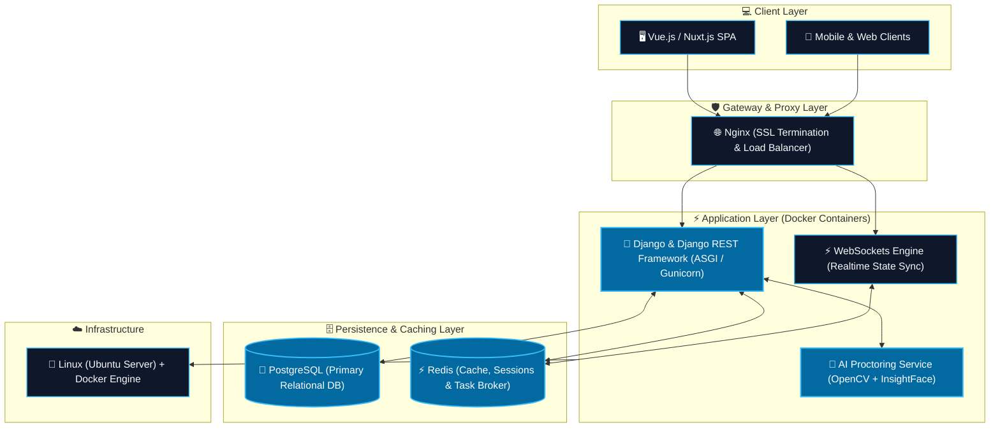

<!-- ======================================================== -->
<!--                      HERO BANNER                         -->
<!-- ======================================================== -->

  

  

  
  
  
  
  

---

### 💫 About Me

I am a **Full Stack Python Developer & AI Systems Architect** from Uzbekistan 🇺🇿. I build robust digital infrastructures, university management platforms, online proctoring systems, and high-performance backend APIs.

- 🏢 Software Engineer at **[@namdudeveloper](https://github.com/namdudeveloper)** & **[@SuniCode-LLC](https://github.com/SuniCode-LLC)**
- 🎓 Specializing in **Large-scale Educational Ecosystems** and **LMS / CRM platforms**
- 🤖 Developing **AI & Computer Vision** solutions (Face Recognition, Behavioral Anti-cheating Proctoring)
- ⚡ Deep expertise in **Clean Architecture**, **Asynchronous Python**, and **High-concurrency WebSockets**
- ☁️ Production-grade deployments with **Docker, Nginx, Redis, and Linux Server Administration**

---

### 🚀 Featured Projects

| Project | Description | Tech Stack | Status |
| :--- | :--- | :--- | :---: |
| 🎓 **University EcoSystem** | Unified digital campus platform managing academic workflows, grading, student services, and faculty portals. | `Django` `Vue.js` `PostgreSQL` `Redis` | 🚀 Production |
| 📝 **Piima Quiz** | Real-time examination & testing engine capable of handling high concurrent student loads. | `DRF` `WebSockets` `Redis` `Vue.js` | 🚀 Production |
| 🤖 **AI Proctoring** | Automated AI surveillance suite featuring face identification, gaze monitoring, and anti-cheating alerts. | `Python` `OpenCV` `InsightFace` `PyTorch` | 🚀 Production |
| 📚 **Edumy CRM & LMS** | All-in-one Learning Management and CRM solution built for modern education academies. | `Django` `DRF` `PostgreSQL` `Tailwind` | 🚀 Production |
| 💼 **SpeedPOS** | Ultra-responsive Point-of-Sale (POS) software for fast-paced retail and services workflows. | `Python` `PostgreSQL` `REST API` | 🚀 Production |
| 🤖 **Zeytun AI** | Intelligent business automation platform integrating custom bots and modern AI workflows. | `Python` `LLM APIs` `AsyncIO` | ⚡ Active |

---

### ⚙ Tech Stack

#### 🐍 Backend & APIs

#### 💻 Frontend & Web

#### 🗄️ Database & Cache

#### ☁️ DevOps & Infrastructure

#### 🛠 Tools & Environment

---

### 📊 GitHub Analytics

  

 

  
  &nbsp;
  

---

### 🏆 Official GitHub Achievements

  
  &nbsp;&nbsp;&nbsp;&nbsp;
  
  &nbsp;&nbsp;&nbsp;&nbsp;
  
   
  

    <b>🦈 Pull Shark (Silver x3)</b> &nbsp;•&nbsp; 
    <b>⚡ Quickdraw</b> &nbsp;•&nbsp; 
    <b>🎯 YOLO</b> &nbsp;•&nbsp; 
    <b>💻 Developer Program</b> &nbsp;•&nbsp; 
    <b>⭐ GitHub Pro</b>
  

---

### 🏗 System Architecture

---

### 🎯 2026 Core Objectives

- [x] 🎓 Scaled University Digital Ecosystem v2 deployment
- [x] 🤖 High-accuracy AI Proctoring pipeline implementation
- [ ] ☁️ Microservices orchestration with Kubernetes & Nomad
- [ ] ⚡ Launching new AI-driven SaaS platforms
- [ ] 🌍 Active open-source tooling contributions
- [ ] 📈 Target: 2,000+ GitHub contributions this year

---

### 🌍 Connect With Me

  
  &nbsp;
  
  &nbsp;
  
  &nbsp;
  
  &nbsp;
  
  &nbsp;
  
  &nbsp;
  

---

  

