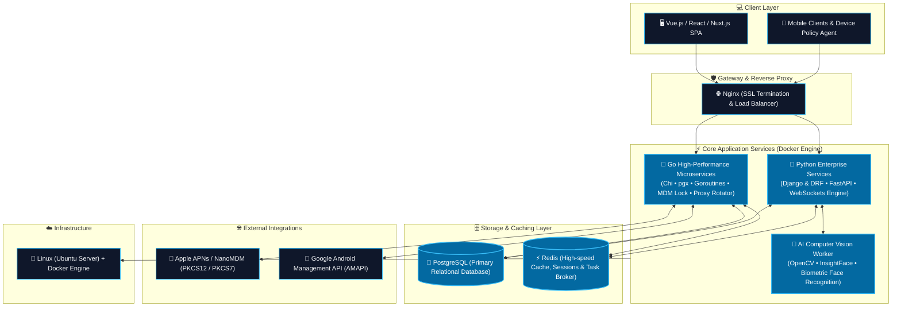

<!-- ======================================================== -->
<!--                      HERO BANNER                         -->
<!-- ======================================================== -->

  

  

  
  
  
  
  
  
  

---

### 💫 About Me

I am a **Backend Architect & Full Stack Engineer (Go & Python)** from Uzbekistan 🇺🇿. I specialize in engineering high-throughput microservices, concurrent network platforms, mobile device management (MDM) engines, and AI-powered proctoring platforms.

- 🏢 Software Engineer at **[@namdudeveloper](https://github.com/namdudeveloper)** & **[@SuniCode-LLC](https://github.com/SuniCode-LLC)**
- 🔷 Building **High-Concurrency Systems in Go (Golang)**: Chi, pgx connection pooling, Goroutines/Channels, Apple NanoMDM & Android AMAPI integrations
- 🐍 Architecting **Enterprise Backends in Python**: Django, Django REST Framework, FastAPI, WebSockets, and Celery
- 🤖 Developing **AI & Computer Vision Solutions**: Facial recognition, gaze estimation, and automated anti-cheating proctoring engines (OpenCV, InsightFace, PyTorch)
- 🎓 Specialized in **University Digital Ecosystems**, **Device Financing Platforms**, and **Real-time Testing Engines**
- ☁️ Production-grade infrastructure with **Docker, Nginx, Redis, PostgreSQL, and Linux Server Administration**

---

### 🚀 Featured Projects

| Project | Description | Tech Stack | Status |
| :--- | :--- | :--- | :---: |
| 📱 **MDM Device Financing Lock** | Enterprise MDM platform for installment smartphone sales. Automates remote locking/unlocking via Apple APNs (PKCS12/7) and Android Management API (AMAPI). | `Go (Golang)` `Chi` `PostgreSQL (pgx)` `React` `AMAPI` | 🚀 Production |
| ⚡ **UZIMEI Pro Batch Validator** | High-throughput IMEI verification engine capable of 1,000+ daily checks. Features dynamic 4G mobile proxy rotator, automatic IP renewal, and zero-latency caching. | `Go (Golang)` `Concurrency` `Proxy Rotator` `Tailwind` | 🚀 Production |
| 🎓 **University EcoSystem** | Unified digital campus infrastructure managing academic workflows, grading, student services, and faculty portals. | `Django` `Vue.js` `PostgreSQL` `Redis` `Docker` | 🚀 Production |
| 📝 **Piima Quiz** | Real-time online examination & testing engine capable of handling high concurrent student loads with zero state loss. | `DRF` `WebSockets` `Redis` `Vue.js` | 🚀 Production |
| 🤖 **AI Proctoring Engine** | Automated AI surveillance suite featuring face biometric verification, gaze monitoring, and anti-cheating alerts. | `Python` `OpenCV` `InsightFace` `PyTorch` | 🚀 Production |
| 📚 **Edumy CRM & LMS** | All-in-one Learning Management and CRM solution built for modern education academies. | `Django` `DRF` `PostgreSQL` `Tailwind` | 🚀 Production |
| 💼 **SpeedPOS** | Ultra-responsive Point-of-Sale (POS) software for fast-paced commercial retail and services workflows. | `Go` `Python` `PostgreSQL` `REST API` | 🚀 Production |
| 🤖 **Zeytun AI** | Intelligent business automation platform integrating custom bots and modern AI workflows. | `Python` `LLM APIs` `AsyncIO` | ⚡ Active |

---

### ⚙ Tech Stack

#### 🔷 Backend & Core Engines (Go & Python)

#### 💻 Frontend & Web Applications

#### 🗄️ Databases & In-Memory Caches

#### ☁️ DevOps, Cloud & Infrastructure

#### 🛠 Development Tools & Environments

---

### 📊 GitHub Analytics

  

 

  
  &nbsp;
  

---

### 🏆 Official GitHub Achievements

  
  &nbsp;&nbsp;&nbsp;&nbsp;
  
  &nbsp;&nbsp;&nbsp;&nbsp;
  
   
  

    <b>🦈 Pull Shark (Silver x3)</b> &nbsp;•&nbsp; 
    <b>⚡ Quickdraw</b> &nbsp;•&nbsp; 
    <b>🎯 YOLO</b> &nbsp;•&nbsp; 
    <b>💻 Developer Program</b> &nbsp;•&nbsp; 
    <b>⭐ GitHub Pro</b>
  

---

### 🏗 System Architecture

---

### 🎯 2026 Core Objectives

- [x] 🔷 High-performance Go microservices & MDM lock platform deployment
- [x] 🎓 Scaled University Digital Ecosystem v2 deployment
- [x] 🤖 High-accuracy AI Proctoring pipeline implementation
- [ ] ☁️ Microservices orchestration with Kubernetes & Nomad
- [ ] ⚡ Launching new AI & Go-driven SaaS platforms
- [ ] 🌍 Active open-source tooling contributions
- [ ] 📈 Target: 2,000+ GitHub contributions this year

---

### 🌍 Connect With Me

  
  &nbsp;
  
  &nbsp;
  
  &nbsp;
  
  &nbsp;
  
  &nbsp;
  
  &nbsp;
  

---

  

